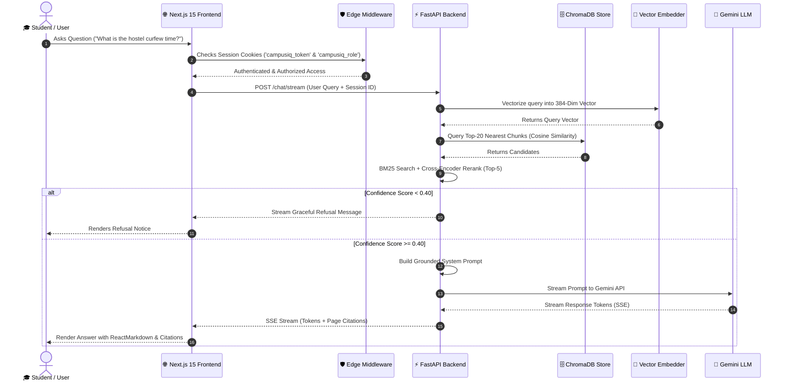
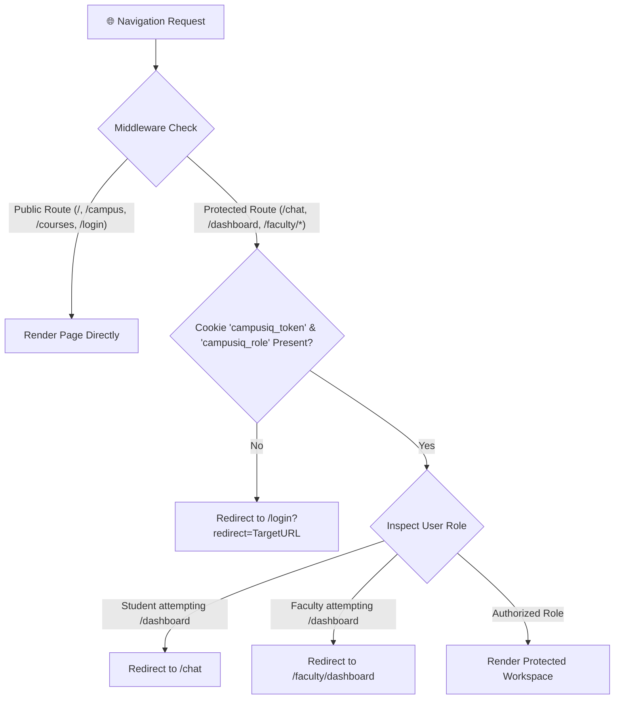

# 🎓 CampusIQ

## AI-Powered Contextual College Website Chatbot using Retrieval-Augmented Generation (RAG)

[](https://nextjs.org/)
[](https://fastapi.tiangolo.com/)
[](https://www.trychroma.com/)
[](https://deepmind.google/technologies/gemini/)
[](https://www.typescriptlang.org/)
[](https://opensource.org/licenses/MIT)

**CampusIQ** is a full-stack, enterprise-grade Educational Platform integrated with an advanced Retrieval-Augmented Generation (RAG) AI Assistant. It enables students, parents, faculty, and campus administrators to retrieve verified, context-aware answers generated directly from official campus documents—handbooks, hostel policies, library rules, syllabus manuals, and examination guidelines—complete with page-level citations and multi-turn conversational memory.

---

## 📋 Table of Contents

- [Preseeded Login Credentials](#-preseeded-login-credentials)
- [RAG Chatbot Pipeline Architecture](#-rag-chatbot-pipeline-architecture)
- [Project Overview](#-project-overview)
- [Key Features by Role](#-key-features-by-role)
- [Technology Stack](#-technology-stack)
- [System Architecture](#-system-architecture)
- [Authentication & Role-Based Authorization](#-authentication--role-based-authorization)
- [Directory Structure](#-directory-structure)
- [API Documentation](#-api-documentation)
- [Database & Vector Schema](#-database--vector-schema)
- [Security & Performance Optimizations](#-security--performance-optimizations)
- [Installation & Local Setup Guide](#-installation--local-setup-guide)
- [Environment Variables](#-environment-variables)
- [Automated & Manual Testing Suite](#-automated--manual-testing-suite)
- [License & Contributors](#-license--contributors)

---

## 🔑 Preseeded Login Credentials

CampusIQ comes preconfigured with local seed accounts for immediate testing across all user roles. No external database seeding script is required—these accounts are auto-seeded into the persistent store on backend startup.

### 👤 Quick Demo Accounts

| Role | User Email | Password | Primary Access & Landing Page | Granted Scope & Capabilities |
|:---|:---|:---|:---|:---|
| **🎓 Student** | `student@mits.edu` | `password123` | `/chat` | AI Tutor Workspace, Courses Catalog, Campus Facilities, Placements, Clubs, FAQs |
| **👨‍🏫 Faculty** | `faculty@mits.edu` | `faculty123` | `/faculty/dashboard` | Faculty Dashboard, Student Queries Monitor, Department Notices, Attendance, Chat |
| **🛡️ Admin (Demo)** | `admin@mits.edu` | `admin123` | `/dashboard` | Admin Control Tower, Knowledge Inspector, Document Upload, System Analytics, RAG Sliders |
| **👑 System Admin** | `admin@campusiq.edu` | `Admin@12345` | `/dashboard` | Complete Platform Control, User Management, AI Config, Security Audit Logs |

> 🔒 **Security Note**: Password hashes are stored using **PBKDF2-HMAC-SHA256** with 100,000 iterations. For production deployments, change the default passwords immediately.

---

## 🤖 RAG Chatbot Pipeline Architecture

CampusIQ implements a **Hybrid Industrial RAG Engine** engineered specifically to eliminate LLM hallucinations when answering campus-related queries.

```
                  ┌─────────────────────────────────────────┐
                  │          Incoming User Query            │
                  └────────────────────┬────────────────────┘
                                       │
                                       ▼
                  ┌─────────────────────────────────────────┐
                  │ 1. Coreference Memory & Multi-Query     │
                  └────────────────────┬────────────────────┘
                                       │
                                       ▼
                  ┌─────────────────────────────────────────┐
                  │ 2. Metadata Pre-Filtering (Dept/Cat)    │
                  └────────────────────┬────────────────────┘
                                       │
                ┌──────────────────────┴──────────────────────┐
                ▼                                             ▼
  ┌───────────────────────────┐                 ┌───────────────────────────┐
  │ 3. Lexical BM25 Search    │                 │ 4. Vector Cosine Search   │
  │    (rank_bm25, Top-20)    │                 │    (ChromaDB, Top-20)     │
  └─────────────┬─────────────┘                 └─────────────┬─────────────┘
                │                                             │
                └──────────────────────┬──────────────────────┘
                                       │
                                       ▼
                  ┌─────────────────────────────────────────┐
                  │ 5. Merge & Deduplicate Candidates       │
                  └────────────────────┬────────────────────┘
                                       │
                                       ▼
                  ┌─────────────────────────────────────────┐
                  │ 6. Cross-Encoder Reranker (Top-5)       │
                  │    (ms-marco-MiniLM-L-6-v2)             │
                  └────────────────────┬────────────────────┘
                                       │
                                       ▼
                  ┌─────────────────────────────────────────┐
                  │ 7. Confidence Score Guard (Cutoff 0.40) │
                  └────────────────────┬────────────────────┘
                                       │
                          ┌────────────┴────────────┐
                          │                         │
                  Score >= 0.40              Score < 0.40
                          │                         │
                          ▼                         ▼
            ┌──────────────────────────┐  ┌──────────────────┐
            │ 8. LLM Grounded Prompt   │  │ Refusal Message  │
            │    (Google Gemini API)   │  │ ("Not in official│
            └─────────────┬────────────┘  │  documents")     │
                          │               └──────────────────┘
                          ▼
            ┌──────────────────────────┐
            │ 9. Token Stream (SSE) +  │
            │    Page-Level Citations  │
            └──────────────────────────┘
```

### 🧩 RAG Component Breakdown

#### 1. Vector Embedding Model
- **Embedding Engine**: `BAAI/bge-small-en-v1.5` / `sentence-transformers/all-MiniLM-L6-v2`
- **Vector Dimension**: 384-dimensional dense semantic vectors
- **Normalized Vector Space**: L2-normalized unit vectors optimized for cosine similarity

#### 2. Vector Database (Vector Store)
- **Engine**: **ChromaDB** (`chromadb.PersistentClient`)
- **Storage Path**: `backend/chroma_db/`
- **Collection Name**: `campusiq_knowledge_store`
- **Distance Metric**: Cosine Distance (`hnsw:space = cosine`)
- **Indexing Graph**: HNSW (Hierarchical Navigable Small World) for fast sub-millisecond k-NN lookups

#### 3. Document Ingestion & Chunking Strategy
- **Supported Parsers**: PDF (`pypdf`), DOCX (`python-docx`), Markdown (`.md`), Plain Text (`.txt`)
- **Chunking Algorithm**: Heading-Aware Markdown Sliding-Window Chunker (`backend/ingestion/pipeline.py`)
- **Chunk Parameters**:
  - **Target Chunk Size**: ~700 tokens (~800 characters)
  - **Chunk Overlap**: ~140 tokens (20% sliding window overlap to prevent context boundary truncation)
- **Structure Protection**: Preserves Markdown tables, bulleted lists, section headers (`#`, `##`, `###`), and PDF page markers (`[Page N]`)
- **Metadata Enriched**: Every chunk automatically embeds `filename`, `page_number`, `category`, `department`, and `section`

#### 4. Hybrid Retrieval & Search Pipeline
- **BM25 Lexical Search**: Uses `rank_bm25` algorithm for exact keyword matching (fees, rule codes, phone numbers).
- **ChromaDB Cosine Retrieval**: Retrieves Top-20 semantically relevant candidate vectors.
- **Candidate Merging & Reciprocal Rank Fusion (RRF)**: Combines keyword and semantic candidate lists while deduplicating duplicate chunk IDs.
- **Cross-Encoder Reranker**: Passes top candidates through `ms-marco-MiniLM-L-6-v2` cross-encoder to compute query-chunk interaction scores and filter down to the Top-5 most relevant chunks.
- **Confidence Scoring & Refusal Guard**: Evaluates reranker confidence score. If the best score falls below **0.40**, the system outputs a graceful refusal rather than hallucinating:
  > *"I couldn't find verified details in the official campus documents. Please contact administration or rephrase your query."*

#### 5. LLM Orchestration & Citation Injection
- **LLM Engine**: **Google Gemini API** (`gemini-1.5-flash` / `gemini-2.5-flash`)
- **System Prompt**: Enforces strict grounding rules—answers must be derived solely from the provided context chunks.
- **Source Citations**: Returns exact document names, page numbers, and similarity scores attached to the response payload.
- **Streaming Output**: Real-time token streaming using FastAPI Server-Sent Events (SSE).

---

## 💡 Project Overview

### What is CampusIQ?
CampusIQ is an intelligent campus knowledge platform built to streamline access to official university information. Traditional university websites force students, parents, and faculty to manually search through dozens of scattered PDF handbooks, circular notices, and deep sub-pages.

### Why Traditional Chatbots Fail
Generic LLM chatbots suffer from two major flaws when used for institutional information:
1. **Hallucination**: Standard LLMs invent non-existent rules, incorrect fee structures, or inaccurate curfew hours.
2. **Lack of Internal Context**: Standard LLMs have no access to a college's private, internal PDF handbooks or recent department circulars.

### How CampusIQ Solves Hallucination
CampusIQ enforces strict **Retrieval-Augmented Generation (RAG)**:
- Questions are vectorized and matched against official campus documents in ChromaDB.
- Relevant document chunks are retrieved and verified using a similarity cutoff threshold.
- Google Gemini receives the user query along with exact document chunks, generating grounded answers backed by **page-level citations**.

---

## ✨ Key Features by Role

```
                          CampusIQ Platform
                                 │
     ┌───────────────────────────┼───────────────────────────┐
     ▼                           ▼                           ▼
🎓 Student Role             👨‍🏫 Faculty Role            🛡️ Admin Role
• AI Tutor Workspace        • Faculty Dashboard         • Admin Control Tower
• Courses Catalog           • Student Queries Feed      • Knowledge Base Inspector
• Campus Facilities         • Circulars & Notices       • Document Ingestion Portal
• Placement Records         • Course Resources          • RAG Governance Sliders
• FAQ Knowledge Hub         • AI Tutor Chat             • Auth Health & Audit Logs
```

### 🎓 Student Features
- **AI Tutor Chat Workspace (`/chat`)**: Multi-turn conversational memory with coreference resolution, voice speech-to-text input, document attachment, and export to PDF/Markdown.
- **Courses Catalog (`/courses`)**: Degree programs breakdown (B.Tech CSE, M.Tech AI, B.Des UI/UX, MBA Tech) with fee structure in Indian Currency (₹).
- **Campus Facilities (`/campus`)**: Hostel fee schedules (Single: ₹1,80,000/yr, Double: ₹1,20,000/yr), Central Library borrowing limits, and HPC GPU AI Lab specs.
- **Placements & Internships (`/placements`)**: Highest package statistics (₹45.0 LPA), average package, and placement cell guidelines.
- **Clubs & Societies (`/clubs`)**: Technical and cultural club directories.

### 👨‍🏫 Faculty Features
- **Faculty Dashboard (`/faculty/dashboard`)**: Dedicated academic portal displaying active departments (CSE & AI/ML), enrolled students, and pending inquiries.
- **Student Queries Feed**: Real-time monitor of student RAG queries with similarity scores.
- **Department Notices**: Exam evaluation schedules, mid-semester guidelines, and compute lab reservations.

### 🛡️ Administrator Features
- **Admin Control Tower (`/dashboard`)**: Platform overview, total indexed documents, vector chunk counts, and system latency metrics.
- **Document Ingestion Portal**: Visual stepper for PDF/DOCX/TXT file parsing, sentence chunking, and embedding.
- **Knowledge Base Inspector**: Inspect extracted text chunks, page numbers, document metadata, and execute vector purges.
- **RAG Engine Governance**: Real-time sliders for Similarity Cutoff Guard ($0.40 - 0.95$) and Top-K Retrieval ($1 - 20$).
- **Auth Health Monitor**: Real-time session inspector displaying user state, cookie/localStorage synchronization, and granted permission lists.
- **Security Audit Logs**: Track authentication events (`USER_LOGIN`, `USER_LOGOUT`, `PASSWORD_RESET`, `GOOGLE_LOGIN`) with timestamped audit records.

---

## 🛠️ Technology Stack

| Component | Layer | Technology / Tool Used | Details & Version |
|:---|:---|:---|:---|
| **Frontend Framework** | UI Core | **Next.js 15** | App Router, React 19, TypeScript 5.0 |
| **Styling & Icons** | UI Aesthetics | **Vanilla CSS & Tailwind CSS** | Lucide Icons, Glassmorphism design system |
| **Backend API** | App Server | **FastAPI** | Python 3.11, Uvicorn, Pydantic v2 |
| **LLM Engine** | RAG Generation | **Google Gemini API** | `gemini-1.5-flash` / `gemini-2.5-flash` |
| **Embedding Model** | Vectorization | **BAAI/bge-small-en-v1.5** | 384-Dimensional Dense Vector Space |
| **Vector Database** | Vector Store | **ChromaDB** | Persistent Vector Store (`chromadb.PersistentClient`) |
| **Reranker Engine** | Ranking | **ms-marco-MiniLM-L-6-v2** | Cross-Encoder candidate reranking |
| **Lexical Search** | Search | **BM25 (`rank_bm25`)** | Keyword search for exact numbers & codes |
| **Authentication** | Security | **PyJWT & Next.js Middleware** | HTTP-Only/Lax Cookies, `localStorage` Sync |
| **Streaming** | Real-Time UI | **Server-Sent Events (SSE)** | Token-by-token streaming response |

---

## 📐 System Architecture

### End-to-End Sequence Diagram



---

## 🔐 Authentication & Role-Based Authorization

CampusIQ implements a dual-layer authentication architecture combining Edge Server Middleware with Client Session Managers:



### Granular Permissions Matrix (`frontend/lib/permissions.ts`)

| Permission Token | Student | Faculty | Administrator |
|:---|:---:|:---:|:---:|
| `student.chat` | ✅ | ✅ | ✅ |
| `student.academics` | ✅ | ✅ | ✅ |
| `student.facilities` | ✅ | ✅ | ✅ |
| `student.placements` | ✅ | ✅ | ✅ |
| `student.clubs` | ✅ | ✅ | ✅ |
| `student.discipline` | ✅ | ✅ | ✅ |
| `student.faqs` | ✅ | ✅ | ✅ |
| `faculty.dashboard` | ❌ | ✅ | ✅ |
| `faculty.queries` | ❌ | ✅ | ✅ |
| `faculty.notices` | ❌ | ✅ | ✅ |
| `admin.dashboard` | ❌ | ❌ | ✅ |
| `admin.documents` | ❌ | ❌ | ✅ |
| `admin.analytics` | ❌ | ❌ | ✅ |
| `admin.training` | ❌ | ❌ | ✅ |
| `admin.governance` | ❌ | ❌ | ✅ |
| `admin.health` | ❌ | ❌ | ✅ |

---

## 📁 Directory Structure

```
custom_rag_chatbot/
├── backend/
│   ├── api/                  # FastAPI Endpoint Modules
│   │   ├── admin.py          # RAG Governance & System Parameters API
│   │   ├── analytics.py      # System KPIs & Unanswered Query Logs API
│   │   ├── auth.py           # Login, Signup, Reset Password & Audit Logs API
│   │   ├── chat.py           # SSE Streaming Chat & Coreference Resolution API
│   │   ├── history.py        # Chat Session History Storage API
│   │   ├── knowledge.py      # Chunk Inspector & Vector Purge API
│   │   ├── public.py         # Sandbox Discovery Queries API
│   │   ├── rag.py            # Cosine Similarity Retrieval API
│   │   └── upload.py         # Multi-file Ingestion & Processing API
│   ├── chroma_db/            # Persistent ChromaDB Vector Store Directory
│   ├── database/             # Supabase & Local DB Client Setup
│   ├── ingestion/            # Heading-Aware Text Chunking Engine & Ingestion Pipeline
│   ├── rag/                  # Hybrid Retrieval, Reranker & Prompt Builder Engine
│   ├── utils/                # Security JWT & Token Helpers
│   ├── config.py             # App Settings & Environment Variables
│   ├── main.py               # FastAPI Main Entrypoint
│   └── requirements.txt      # Python Dependencies
├── campus_documents/         # Official College Handbooks (Admissions, Fees, Hostel, Rules)
├── frontend/
│   ├── app/
│   │   ├── (auth)/           # Login (/login) & Register (/register) Pages
│   │   ├── campus/           # Facilities & Hostel Fees Page
│   │   ├── chat/             # AI Tutor Chat Workspace Page
│   │   ├── clubs/            # Clubs & Societies Directory Page
│   │   ├── components/       # UI Components (Navbar, AIChatWidget, Sidebar)
│   │   ├── courses/          # Degree Programs Catalog Page
│   │   ├── dashboard/        # Admin Control Tower Page
│   │   ├── discipline/       # Conduct & Disciplinary Rules Page
│   │   ├── faculty/          # Faculty Member Portal (/faculty/dashboard)
│   │   ├── faqs/             # FAQ Hub Page
│   │   ├── placements/       # Placements & Internships Page
│   │   ├── unauthorized/     # HTTP 403 Forbidden Access Denied Page
│   │   ├── layout.tsx        # Global Layout Wrapper
│   │   └── page.tsx          # CampusIQ Landing Page
│   ├── lib/                  # Modules (permissions, redirectUtils, publicApi, chatApi)
│   ├── middleware.ts         # Next.js Edge Server Middleware Route Guard
│   └── package.json          # Node.js Dependencies
└── README.md                 # Complete System Documentation
```

---

## 📡 API Documentation

### Authentication Endpoints

#### `POST /auth/login`
Authenticates campus users and returns JWT access token + user profile.
- **Request Body**:
  ```json
  {
    "email": "student@mits.edu",
    "password": "password123"
  }
  ```
- **Response (200 OK)**:
  ```json
  {
    "user_id": "usr-student-001",
    "name": "Demo Student",
    "email": "student@mits.edu",
    "role": "student",
    "access_token": "campusiq-demo-token",
    "token_type": "bearer"
  }
  ```

### Chat & Retrieval Endpoints

#### `POST /chat/stream`
Streams live RAG AI answers with SSE tokens and page-level citations.
- **Request Body**:
  ```json
  {
    "message": "What is the hostel curfew time?",
    "session_id": "default-session"
  }
  ```
- **Response**: `text/event-stream` stream yielding text chunks and source citations.

---

## ⚡ Installation & Local Setup Guide

### Prerequisites
- **Node.js**: `v18.0.0` or higher
- **Python**: `3.10` or `3.11`
- **Git**

### 1. Backend Setup
```bash
# From the project root directory
pip install -r backend/requirements.txt

# Start FastAPI server on port 8000
python -m uvicorn backend.main:app --host 127.0.0.1 --port 8000 --reload
```
- API Docs: `http://localhost:8000/docs`

### 2. Frontend Setup
```bash
# Open a second terminal window
cd frontend

# Install Node dependencies
npm install

# Start Next.js development server
npm run dev
```
- CampusIQ Platform: `http://localhost:3000`

---

## 🔑 Environment Variables

### Frontend `.env.local`
```env
NEXT_PUBLIC_API_URL=http://localhost:8000
NEXT_PUBLIC_SUPABASE_URL=https://cqdmmbwolmpollekbahh.supabase.co
NEXT_PUBLIC_SUPABASE_ANON_KEY=your-supabase-anon-key
```

### Backend `.env`
```env
PROJECT_NAME="CampusIQ API"
GEMINI_API_KEY=your-google-gemini-api-key
SUPABASE_URL=https://cqdmmbwolmpollekbahh.supabase.co
SUPABASE_KEY=your-supabase-anon-key
ALLOWED_ORIGIN=http://localhost:3000
```

---

## 🧪 Automated & Manual Testing Suite

CampusIQ contains automated verification scripts in `scratch/`:

```bash
# Run RAG Grounded Retrieval Accuracy Tests
python scratch/manual_test_10_sections.py

# Run Authentication & Role-Based Routing Verification
python scratch/test_all_requirements.py
```

---

## 📜 License & Contributors

© 2026 **CampusIQ Team**. Distributed under the MIT License.
